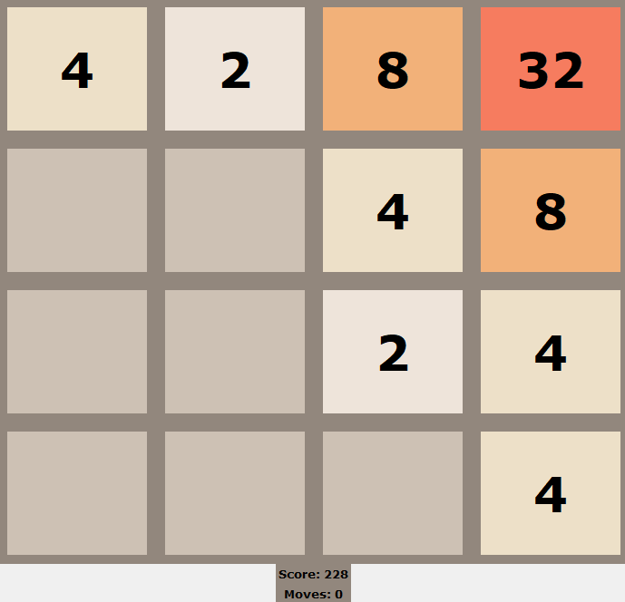

# 2048-neat (WIP)

Uses https://neat-python.readthedocs.io/en/latest/ to explore what Neural Evolving Augmenting Topologies (NEAT) could do with 2048.

[evolve_2048.py](2048-neat/evolve_2048.py) contains the fitness function.

The aim of this project is to experience NEAT in action and explore things such as how difference fitness functions improves optimization while staying general (i.e. not specifically telling the neural net of what's good and bad). Note that NEAT is not particularly the best approach to solve an optimal solution for the game 2048 (See: [this Stack Overflow post on Expectimax](https://stackoverflow.com/questions/22342854/what-is-the-optimal-algorithm-for-the-game-2048)).

Some examples of general vs non-general (but better performing) fitness functions are:
* f(x) = Score, the most general.
* f(x) = Score * Highest Tile, here the importance of obtaining higher tiles is explicit.
* f(x) = Score * x, where x is a multiplier when the game ends with two equal tiles adjacent to each other.

**Average fitness after 50 generations**

**The A.I. training in generation #9**

